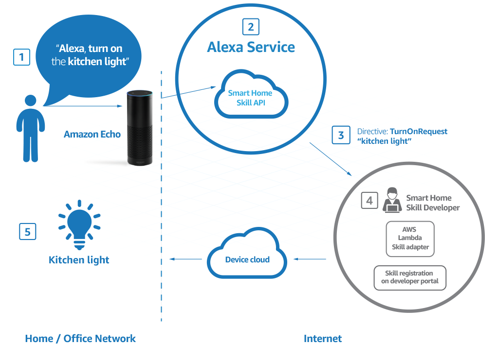

# Shedding Light on Alexa
 
It's the name on everyone's lips. Amazons new home assistant is the new Siri. She tells you the weather, shops, books an Uber or streams your music. A world of possibilities. I didn't know what Alexa was 12 months ago now I almost can't imagine my life without it. Not to mention my gadget obsessed Husband has stocked our small one bedroom apartment with 3 of them. Alexa represents a new type of hardware to develop for. Alexa is also popular with developers because the software behind it is open.  As a new coder, I haven't built anything outside of my laptop I am excited by the new challenge developing for Alexa will pose. I have been learning Python, which is one of the languages supported by Alexa and I would like to put these skills to use. One of my personal projects is to write code for Alexa, specifically to integrate with my light globes.  To go about doing this I first need to define the problem and the aspects of this problem that I don’t know the answers to.
 
*The problem:*
I have WeMo light globes that don't have native support with Alexa. Can I learn the new framework and design commands to be able to turn my lights on and off with Alexa?
 
What do I need to know about Alexa's software to be able to design this functionality?
What do I need to know about WeMo light bulbs to be able to design this functionality? 
 
## Introducing the Alexa Skills Kit
You can design new 'skills' for Alexa using Amazon's [Alexa Skills Kit](https://developer.amazon.com/public/solutions/alexa/alexa-skills-kit/getting-started-guide). It supports the building of many different types of functions. For my purpose I want to use the [Smart Home Skill API](https://developer.amazon.com/public/solutions/alexa/alexa-skills-kit/overviews/understanding-the-smart-home-skill-api). The API enables new skills to be created for cloud-connected devices with the appropriate authentication system. In this way, the API defines the requests the skill can handle and what users say to prompt these requests.
 
## What's this about a  service, adapters and directives?
There are a lot of buzzwords that get introduced in the Alexa Skills kit documentation. To simplify, the idea is to create a cloud-based 'service' that handles the requests for the skill type and hosts it in the cloud. This also differs based on which skill kit you want to work with. For my case, using the Smart Home Skill API, you develop what's called a skill 'adapter'  that accepts commands from Alexa and directs the connected smart device.
 
This is broken down in the image below


 
1. Someone says the command to Alexa.
2. Alexa hears the instruction and sends to the service for interpretation.
3. The API interprets the action and sends a message (called the directive which is JSON) to the skill adapter.
4. The Skill adapter is an AWS Lambda function (this is the Python!!) and it receives the message and uses the information to communicate with the device cloud. Passing on the message.
5. The new device is able to handle the request, and sends a response back to the API indicating the success.
 
 
So this helps me understand the steps I have to go through to design the code for this. The skill itself is the code and configuration that interprets directives and sends messages to cloud devices and I can write this using Python, my language of choice.
 
## What is an AWS Lambda function?
AWS Lambda runs your code without provisioning or managing servers, only paying for the compute time you actually use when the code is running. This makes it simple, not having to worry about servers and Alexa functions fit into Lambda's free tier where the first one million requests each month are free. For the functionality of my house lights, this will be more than adequate.
The  Lambda function will model the code below which is provided in the docs for Smart Home Skills shown below.
 
First, there is an overall handler function which handles the JSON directive from the API when a request is sent. It checks the `namespace` in the header and directs to either the `handlediscorvery` function or the `handleControl` function.

```Python
def lambda_handler(event, context):
    access_token = event['payload']['accessToken']

    if event['header']['namespace'] == 'Alexa.ConnectedHome.Discovery':
        return handleDiscovery(context, event)

    elif event['header']['namespace'] == 'Alexa.ConnectedHome.Control':
        return handleControl(context, event)
```


The handleDiscovery function handles the communication with the device and setting up a connection.
```Python 
def handleDiscovery(context, event):
    payload = ''
    header = {
        "namespace": "Alexa.ConnectedHome.Discovery",
        "name": "DiscoverAppliancesResponse",
        "payloadVersion": "2"
        }

    if event['header']['name'] == 'DiscoverAppliancesRequest':
        payload = {
            "discoveredAppliances":[
                {
                    "applianceId":"device001",
                    "manufacturerName":"yourManufacturerName",
                    "modelName":"model 01",
                    "version":"your software version number here.",
                    "friendlyName":"Smart Home Virtual Device",
                    "friendlyDescription":"Virtual Device for the Sample Hello World Skill",
                    "isReachable":True,
                    "actions":[
                        "turnOn",
                        "turnOff"
                    ],
                    "additionalApplianceDetails":{
                        "extraDetail1":"optionalDetailForSkillAdapterToReferenceThisDevice",
                        "extraDetail2":"There can be multiple entries",
                        "extraDetail3":"but they should only be used for reference purposes.",
                        "extraDetail4":"This is not a suitable place to maintain current device state"
                    }
                }
            ]
        }
    return { 'header': header, 'payload': payload }
```

The handleControl function takes the context and event which uses dictates the method to perform. In this case, it's TurnON.
 
```Python
def handleControl(context, event):
    payload = ''
    device_id = event['payload']['appliance']['applianceId']
    message_id = event['header']['messageId']

    if event['header']['name'] == 'TurnOnRequest':
        payload = { }

    header = {
        "namespace":"Alexa.ConnectedHome.Control",
        "name":"TurnOnConfirmation",
        "payloadVersion":"2",
        "messageId": message_id
        }
    return { 'header': header, 'payload': payload }
```

To enable this communication, the device cloud should support the OAuth 2.0 authorization type.  You will need information about the authentication endpoint, client ID, and secret to complete the smart home skill registration

With all this information I feel much better about developing for Alexa and solving the problem I have with my kitchen lights. Amazon has a lot of docs but sometimes finding the information you need can be hard. I now can't wait to get experimenting to try and link my lights up. I hope my next blog post is a walkthrough of my experience in implementing the code.
